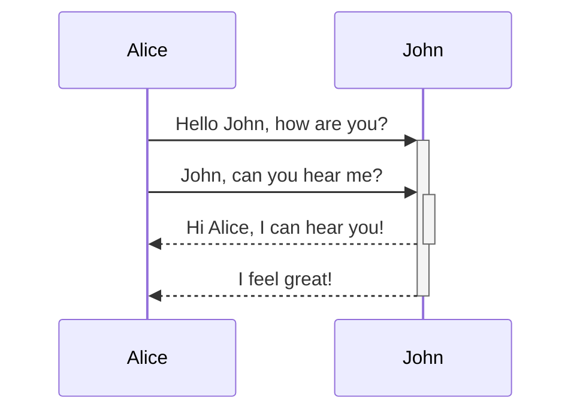

[[How To Setup GitHub Runner]]

## General

```mermaid 
sequenceDiagram 
Alice->>+John: Hello John, how are you? 
Alice->>+John: John, can you hear me? 
John-->>-Alice: Hi Alice, I can hear you! 
John-->>-Alice: I feel great! 
```

## Setup
1234

### Install Dependencies

test

### Build System

test
#### Install Other Things
test

#### Install more things

### Finish Setup
Done
